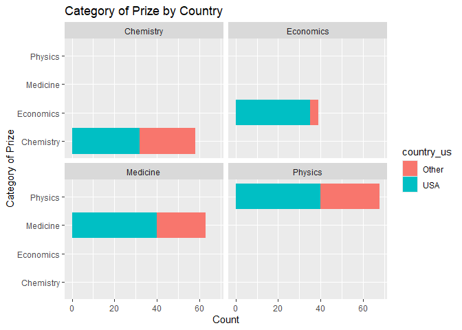
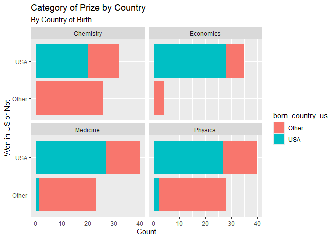

Lab 03 - Nobel Laureates
================
Hannah Crawley
1/28/2025

### Load packages and data

``` r
library(tidyverse) 
```

``` r
nobel <- read_csv("data/nobel.csv")
```

## Exercises

### Exercise 1

``` r
nobel %>% 
  print()
```

    ## # A tibble: 935 × 26
    ##       id firstname   surname  year category affiliation city  country born_date 
    ##    <dbl> <chr>       <chr>   <dbl> <chr>    <chr>       <chr> <chr>   <date>    
    ##  1     1 Wilhelm Co… Röntgen  1901 Physics  Munich Uni… Muni… Germany 1845-03-27
    ##  2     2 Hendrik A.  Lorentz  1902 Physics  Leiden Uni… Leid… Nether… 1853-07-18
    ##  3     3 Pieter      Zeeman   1902 Physics  Amsterdam … Amst… Nether… 1865-05-25
    ##  4     4 Henri       Becque…  1903 Physics  École Poly… Paris France  1852-12-15
    ##  5     5 Pierre      Curie    1903 Physics  École muni… Paris France  1859-05-15
    ##  6     6 Marie       Curie    1903 Physics  <NA>        <NA>  <NA>    1867-11-07
    ##  7     6 Marie       Curie    1911 Chemist… Sorbonne U… Paris France  1867-11-07
    ##  8     8 Lord        Raylei…  1904 Physics  Royal Inst… Lond… United… 1842-11-12
    ##  9     9 Philipp     Lenard   1905 Physics  Kiel Unive… Kiel  Germany 1862-06-07
    ## 10    10 J.J.        Thomson  1906 Physics  University… Camb… United… 1856-12-18
    ## # ℹ 925 more rows
    ## # ℹ 17 more variables: died_date <date>, gender <chr>, born_city <chr>,
    ## #   born_country <chr>, born_country_code <chr>, died_city <chr>,
    ## #   died_country <chr>, died_country_code <chr>, overall_motivation <chr>,
    ## #   share <dbl>, motivation <chr>, born_country_original <chr>,
    ## #   born_city_original <chr>, died_country_original <chr>,
    ## #   died_city_original <chr>, city_original <chr>, country_original <chr>

935 observations - each row represents a different person

### Exercise 2

``` r
nobel_living <- nobel %>%
  filter(!is.na(country), gender != "org", is.na(died_date))
```

### Exercise 3

``` r
nobel_living <- nobel_living %>%
  mutate(
    country_us = if_else(country == "USA", "USA", "Other")
  )
```

``` r
nobel_living_science <- nobel_living %>%
  filter(category %in% c("Physics", "Medicine", "Chemistry", "Economics"))
```

``` r
ggplot(nobel_living_science, aes(x = category, fill = country_us)) +
  geom_bar() + 
  labs(title = "Category of Prize by Country", x = "Category of Prize", y = "Count") + coord_flip() + facet_wrap(~ category)  
```

<!-- --> - The majority of econ
winners are from the US  
- Roughly 1/2 of the chem winners are from the US - About 2/3 of the
medicine winners are from the US - A little over 1/2 of chemistry
winners are from the US

These results are similar to the graphs presented by BuzzFeed claiming
most nobel laureates were based in the US when they one there prize

### Exercise 4

``` r
nobel_born_count <- nobel_living_science %>%
  mutate(
    born_country_us = if_else(born_country == "USA", "USA", "Other")
  )
```

``` r
glimpse(nobel_born_count)
```

    ## Rows: 228
    ## Columns: 28
    ## $ id                    <dbl> 68, 69, 95, 97, 98, 99, 101, 103, 106, 107, 111,…
    ## $ firstname             <chr> "Chen Ning", "Tsung-Dao", "Leon N.", "Leo", "Iva…
    ## $ surname               <chr> "Yang", "Lee", "Cooper", "Esaki", "Giaever", "Jo…
    ## $ year                  <dbl> 1957, 1957, 1972, 1973, 1973, 1973, 1974, 1975, …
    ## $ category              <chr> "Physics", "Physics", "Physics", "Physics", "Phy…
    ## $ affiliation           <chr> "Institute for Advanced Study", "Columbia Univer…
    ## $ city                  <chr> "Princeton NJ", "New York NY", "Providence RI", …
    ## $ country               <chr> "USA", "USA", "USA", "USA", "USA", "United Kingd…
    ## $ born_date             <date> 1922-09-22, 1926-11-24, 1930-02-28, 1925-03-12,…
    ## $ died_date             <date> NA, NA, NA, NA, NA, NA, NA, NA, NA, NA, NA, NA,…
    ## $ gender                <chr> "male", "male", "male", "male", "male", "male", …
    ## $ born_city             <chr> "Hofei Anhwei", "Shanghai", "New York NY", "Osak…
    ## $ born_country          <chr> "China", "China", "USA", "Japan", "Norway", "Uni…
    ## $ born_country_code     <chr> "CN", "CN", "US", "JP", "NO", "GB", "GB", "US", …
    ## $ died_city             <chr> NA, NA, NA, NA, NA, NA, NA, NA, NA, NA, NA, NA, …
    ## $ died_country          <chr> NA, NA, NA, NA, NA, NA, NA, NA, NA, NA, NA, NA, …
    ## $ died_country_code     <chr> NA, NA, NA, NA, NA, NA, NA, NA, NA, NA, NA, NA, …
    ## $ overall_motivation    <chr> NA, NA, NA, NA, NA, NA, NA, NA, NA, NA, NA, NA, …
    ## $ share                 <dbl> 2, 2, 3, 4, 4, 2, 2, 3, 2, 3, 4, 4, 3, 3, 2, 1, …
    ## $ motivation            <chr> "\"for their penetrating investigation of the so…
    ## $ born_country_original <chr> "China", "China", "USA", "Japan", "Norway", "Uni…
    ## $ born_city_original    <chr> "Hofei Anhwei", "Shanghai", "New York NY", "Osak…
    ## $ died_country_original <chr> NA, NA, NA, NA, NA, NA, NA, NA, NA, NA, NA, NA, …
    ## $ died_city_original    <chr> NA, NA, NA, NA, NA, NA, NA, NA, NA, NA, NA, NA, …
    ## $ city_original         <chr> "Princeton NJ", "New York NY", "Providence RI", …
    ## $ country_original      <chr> "USA", "USA", "USA", "USA", "USA", "United Kingd…
    ## $ country_us            <chr> "USA", "USA", "USA", "USA", "USA", "Other", "Oth…
    ## $ born_country_us       <chr> "Other", "Other", "USA", "Other", "Other", "Othe…

``` r
nobel_born_count %>%  
  count(born_country_us)
```

    ## # A tibble: 2 × 2
    ##   born_country_us     n
    ##   <chr>           <int>
    ## 1 Other             123
    ## 2 USA               105

105/228 winners were born in the US

### Exercise 5

``` r
ggplot(nobel_born_count, aes(x = country_us, fill = born_country_us)) +
  geom_bar(position = "stack") + 
  labs(title = "Category of Prize by Country", subtitle = "By Country of Birth", x = "Won in US or Not", y = "Count") + coord_flip() + facet_wrap(~ category)
```

<!-- -->

Key results:  
- many of the nobel laureate winners were in the US when they won the
award, but were born outside of the US  
- winners of categories such as econ tend to be US-born where as physics
tend to be internationally born  
- results appear to support the BuzzFeed article’s claim that
immigration is important to since because many nobel laureates are not
US-born

### Exercise 6

``` r
nobel_born_count %>% 
  filter(born_country_us == "Other") %>%
  count(born_country)%>% 
  arrange(desc(n)) 
```

    ## # A tibble: 33 × 2
    ##    born_country       n
    ##    <chr>          <int>
    ##  1 Germany           20
    ##  2 Japan             17
    ##  3 United Kingdom    16
    ##  4 France             8
    ##  5 Canada             6
    ##  6 China              6
    ##  7 Switzerland        6
    ##  8 Israel             5
    ##  9 Norway             4
    ## 10 Australia          3
    ## # ℹ 23 more rows

Germany is the most common country (20 award winners)
